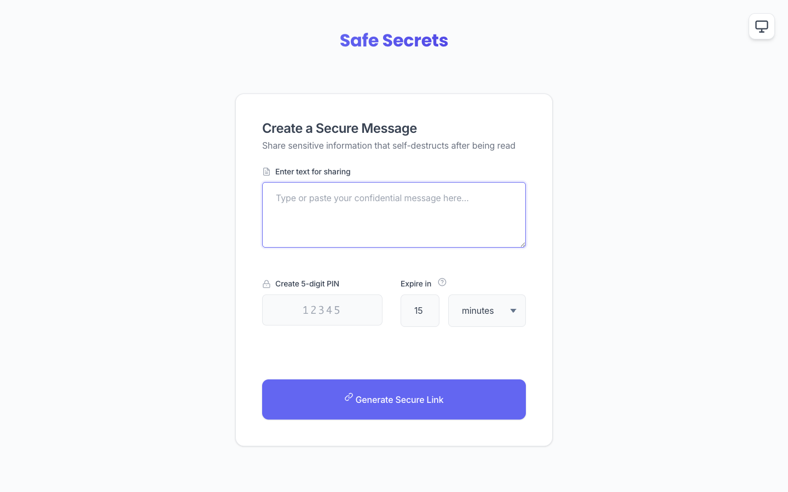
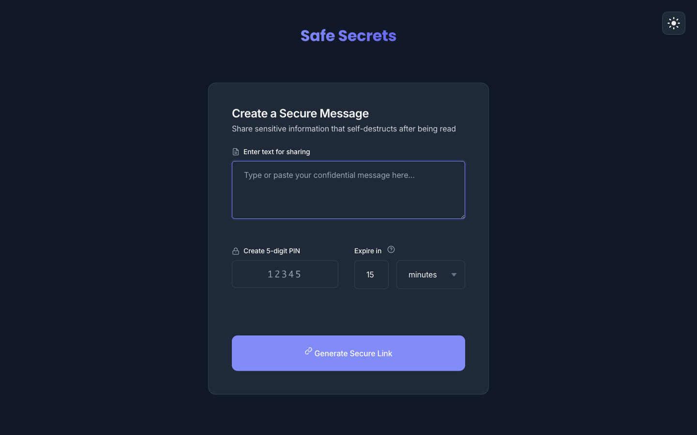
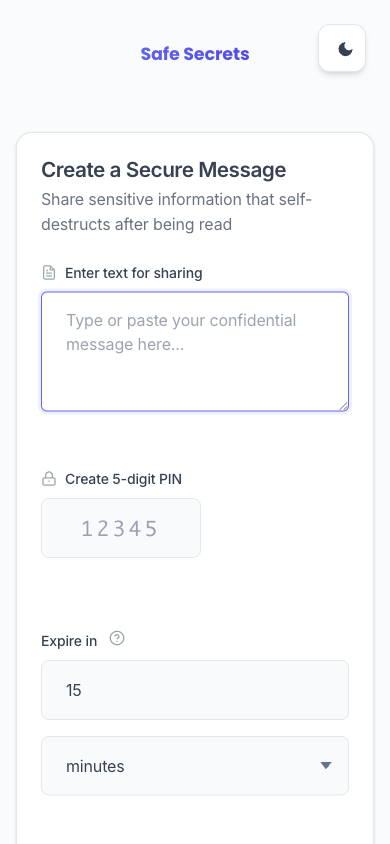
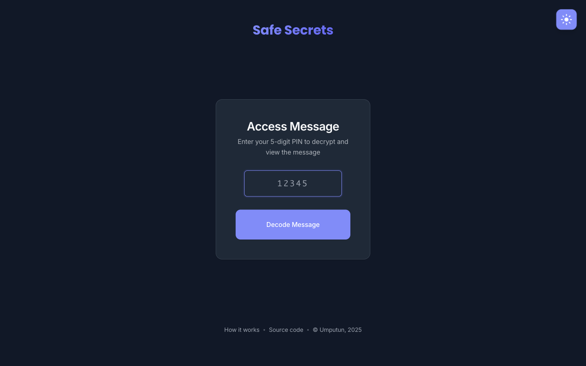
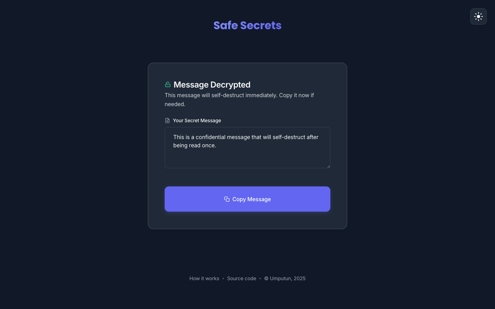

# Safe Secrets - safe(r) and easy way to transfer sensitive data

[](https://github.com/umputun/secrets/actions) [](https://goreportcard.com/report/github.com/umputun/secrets) [](https://coveralls.io/github/umputun/secrets?branch=master) [](https://hub.docker.com/r/umputun/secrets/)

The primary use case is sharing sensitive data securely - messages that self-destruct, can only be accessed once, and are protected by an easy-to-share PIN code. I got tired of the usual "security" approach of sending username and password in two separate emails - that's just a joke. So I built this as a simple and better alternative to passing passwords around.

## Quick Start

```bash
# run with docker
docker run -p 8080:8080 -e SIGN_KEY=your-random-secret-key -e DOMAIN=localhost -e PROTOCOL=http umputun/secrets

# or build and run locally
cd app && go build -o secrets && ./secrets -k "your-secret-key" -d localhost -p http
```

Then open http://localhost:8080 in your browser.

## How It Works

1. Enter your secret message (or upload a file)
2. Set expiration time and a PIN
3. Get a one-time link to share

Your recipient opens the link, enters the PIN, and sees the message. That's it. The message is deleted immediately after reading, and wrong PIN attempts are limited (default: 3 tries).

**Try it live:** [safesecret.info](https://safesecret.info) - feel free to use it if you're crazy enough to trust me, or run your own instance.

<details>
<summary><b>Screenshots</b> (click to expand)</summary>

### Desktop View


### Dark Mode


### Mobile View


### PIN Entry


### Decoded Message


</details>

## How Safe Is This Thing

- Messages are encrypted with your PIN (which is also hashed) - the original is never stored
- Nothing sensitive in logs
- Nothing on disk by default (in-memory storage)
- Messages are permanently destroyed after reading or expiration
- An attacker would need both the link AND the PIN to access anything

_Feel free to suggest any other ways to make the process safer._

## Installation

### Docker (Recommended)

**Simple setup:**

```bash
docker run -p 8080:8080 \
  -e SIGN_KEY=your-long-random-secret \
  -e DOMAIN=example.com \
  -e PROTOCOL=https \
  umputun/secrets
```

**Production setup with docker-compose:**

1. Download `docker-compose.yml` from this repo
2. Configure environment variables (see Configuration section below)
3. Run `docker-compose up -d`

For SSL termination, put a reverse proxy in front (e.g., [reproxy](https://github.com/umputun/reproxy), nginx, or traefik).

_See [docker-compose.yml](https://github.com/umputun/secrets/blob/master/docker-compose.yml) for a complete example._

### Binary

Download from releases or build from source:

```bash
cd app && go build -o secrets
./secrets -k "your-secret-key" -d "example.com" -p https
```

## Configuration

All options work as both CLI flags and environment variables. The app listens on port **8080** by default.

### Core Options

| Flag | Env Variable | Default | Description |
|------|--------------|---------|-------------|
| `-k, --key` | `SIGN_KEY` | *required* | Signing key for encryption |
| `-d, --domain` | `DOMAIN` | *required* | Site domain(s), comma-separated for multiple |
| `-p, --protocol` | `PROTOCOL` | `https` | Site protocol (http/https) |
| `--branding` | `BRANDING` | `Safe Secrets` | Application title |
| `--branding-url` | `BRANDING_URL` | `https://safesecret.info` | Branding link URL for emails |
| `--dbg` | - | `false` | Enable debug mode |

### Message Settings

| Flag | Env Variable | Default | Description |
|------|--------------|---------|-------------|
| `--pinsize` | `PIN_SIZE` | `5` | PIN length in characters |
| `--expire` | `MAX_EXPIRE` | `24h` | Maximum message lifetime |
| `--pinattempts` | `PIN_ATTEMPTS` | `3` | Max wrong PIN attempts |

### Storage

| Flag | Env Variable | Default | Description |
|------|--------------|---------|-------------|
| `-e, --engine` | `ENGINE` | `MEMORY` | Storage engine: MEMORY or BOLT |
| `--bolt` | `BOLT_FILE` | `/tmp/secrets.bd` | BoltDB file path |

### File Uploads

Share files securely - they're encrypted with your PIN just like text messages and self-destruct after download. The filename is preserved but stored encrypted.

| Flag | Env Variable | Default | Description |
|------|--------------|---------|-------------|
| `--files.enabled` | `FILES_ENABLED` | `false` | Enable file uploads |
| `--files.max-size` | `FILES_MAX_SIZE` | `1048576` | Max file size in bytes (1MB) |

### Authentication

Optional password protection for creating secrets. When enabled, users must log in before they can generate links. Viewing/consuming secrets remains anonymous - no login required to open a link with the correct PIN.

| Flag | Env Variable | Default | Description |
|------|--------------|---------|-------------|
| `--auth.hash` | `AUTH_HASH` | *disabled* | bcrypt hash to enable auth |
| `--auth.session-ttl` | `AUTH_SESSION_TTL` | `168h` | Session lifetime (7 days) |

**Generate a bcrypt hash:**

```bash
# htpasswd (Apache utils)
htpasswd -bnBC 10 "" yourpassword | tr -d ':'

# mkpasswd (apt install whois)
mkpasswd -m bcrypt yourpassword

# Docker
docker run --rm caddy caddy hash-password --plaintext yourpassword
```

**Web UI:** Login popup appears when creating a secret. Sessions stored in cookies.

**API:** Requires HTTP Basic Auth with username `secrets` and your password.

### Email Sharing

Send secret links directly via email. Recipients receive a nicely formatted email with the link - they still need the PIN (share it separately for security).

| Flag | Env Variable | Default | Description |
|------|--------------|---------|-------------|
| `--email.enabled` | `EMAIL_ENABLED` | `false` | Enable email sharing |
| `--email.host` | `EMAIL_HOST` | *required* | SMTP server host |
| `--email.port` | `EMAIL_PORT` | `587` | SMTP server port |
| `--email.username` | `EMAIL_USERNAME` | - | SMTP auth username |
| `--email.password` | `EMAIL_PASSWORD` | - | SMTP auth password |
| `--email.from` | `EMAIL_FROM` | *required* | Sender address (e.g., `"App Name <noreply@example.com>"`) |
| `--email.tls` | `EMAIL_TLS` | `false` | Use TLS (not STARTTLS) |
| `--email.timeout` | `EMAIL_TIMEOUT` | `30s` | Connection timeout |
| `--email.template` | `EMAIL_TEMPLATE` | *built-in* | Custom email template path |

When enabled, a "Send Email" button appears after creating a secret link. The email includes a preview of the message body (customizable via template).

> [!WARNING]
> **Do not enable email sharing on public instances without authentication (`--auth.hash`).** Without auth, anyone can use your SMTP server to send emails to arbitrary addresses, which can be abused for spam or phishing. Always require authentication when email sharing is enabled on publicly accessible instances.

### Examples

```bash
# basic usage
./secrets -k "secret-key" -d "example.com"

# multiple domains
./secrets -k "secret-key" -d "example.com,alt.example.com"

# persistent storage
./secrets -k "secret-key" -d "example.com" -e BOLT --bolt=/data/secrets.db

# with file uploads (5MB limit)
./secrets -k "secret-key" -d "example.com" --files.enabled --files.max-size=5242880

# with authentication
./secrets -k "secret-key" -d "example.com" --auth.hash='$2a$10$...'

# with email sharing
./secrets -k "secret-key" -d "example.com" \
  --email.enabled --email.host=smtp.example.com \
  --email.from="Safe Secrets <noreply@example.com>"
```

## Architecture

**Safesecret** is a single binary with embedded web UI. Typical production setup:

- `secrets` container - handles API and serves the web interface (port 8080)
- reverse proxy - SSL termination ([reproxy](https://github.com/umputun/reproxy), nginx, traefik, etc.)

The app works fine without a proxy for development or if you're running behind a load balancer (AWS ALB, haproxy, etc.).

## Integrations

- [Raycast Extension](https://www.raycast.com/melonamin/safe-secret) - share text quickly from Raycast
- [Apple Shortcut](https://www.icloud.com/shortcuts/1d0a8d22c3884c8d80341ccffb502931) - adds Safesecret to Share menu on iOS/macOS

## API

Simple REST API for programmatic access.

### Health Check

```
GET /ping
```

```bash
$ curl https://safesecret.info/ping
pong
```

### Create Secret

```
POST /api/v1/message
```

Body: `{"message": "secret text", "exp": 3600, "pin": "12345"}`

- `exp` - expiration in seconds
- `pin` - PIN code (must match configured length)
- Requires Basic Auth when authentication is enabled (user: `secrets`)

```bash
$ curl -X POST https://safesecret.info/api/v1/message \
  -H "Content-Type: application/json" \
  -d '{"message": "my secret", "exp": 3600, "pin": "12345"}'

{
  "exp": "2024-01-15T10:30:00Z",
  "key": "f1acfe04-277f-4016-518d-16c312ab84b5"
}
```

### Retrieve Secret

```
GET /api/v1/message/:key/:pin
```

```bash
$ curl https://safesecret.info/api/v1/message/f1acfe04-277f-4016-518d-16c312ab84b5/12345

{
  "key": "f1acfe04-277f-4016-518d-16c312ab84b5",
  "message": "my secret"
}
```

### Get Configuration

```
GET /api/v1/params
```

```bash
$ curl https://safesecret.info/api/v1/params

{
  "max_exp_sec": 86400,
  "max_pin_attempts": 3,
  "pin_size": 5,
  "files_enabled": true,
  "max_file_size": 1048576
}
```
